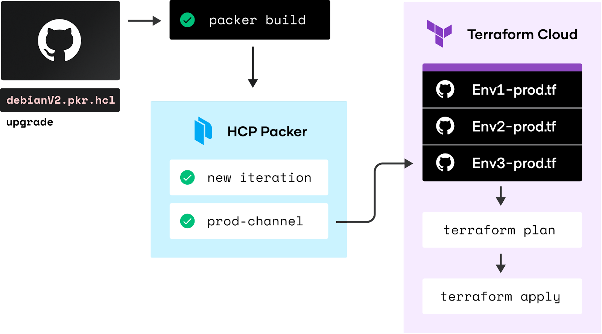
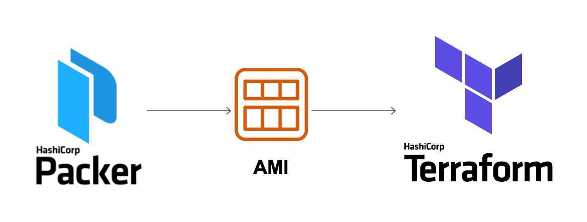

layout: false
class: col-2
background-image: url(../../assets/images/backgrounds/HashiCorp-Content-bkg.png)
background-size: cover
name: Packer & Terraform Benefits
count: true

# Packer & Terraform Benefits

- Accelerated Infrastructure Deployment

- Multi-Provider Portability

- Improved Stability

- Greater Testability

- Simplified Infrastructure Updates

 
 

???

Give an example of each benefit: 

 - Super fast infrastructure deployment
    - Packer images allow you to launch completely provisioned and configured machines in seconds, rather than several minutes or hours. While Terraform automates infrastructure provisioning at scale, helping organizations improve productivity, reduce risk, and increase business velocity as they integrate cloud into their IT environments. 
    - This benefits not only production, but development as well, since development virtual machines in lower envs can also be launched in seconds, without waiting for a typically much longer provisioning time.

 - Multi-provider portability
    - Packer & Terraform are vendor agnostic, allowing users to create infrastructure from identical images for multiple platforms, you can run production in AWS, staging/QA in a private cloud like OpenStack, and development in desktop virtualization solutions such as VMware or VirtualBox. Each environment is running an identical machine image, managed by Terraform, giving ultimate portability.

 - Improved stability
    - Packer installs and configures all the software for a machine at the time the image is built. If there are bugs in these scripts, they'll be caught early, rather than several minutes after a machine is launched.
    - Terraform provides improved stability and productivity with Drift Detection, allowing you to securely scale based on business demand and continuously check against infrastructure state to detect changes.

 - Greater testability
    - After a machine image is built, that machine image can be quickly launched and smoke tested to verify that things appear to be working. If they are, you can be confident that any other machines launched from that image will function properly. 

 - Simpliflied infrastructure updates
    - Minimize cloud waste with consistent provisioning of compliant environments across hundreds of teams and multiple business units.

