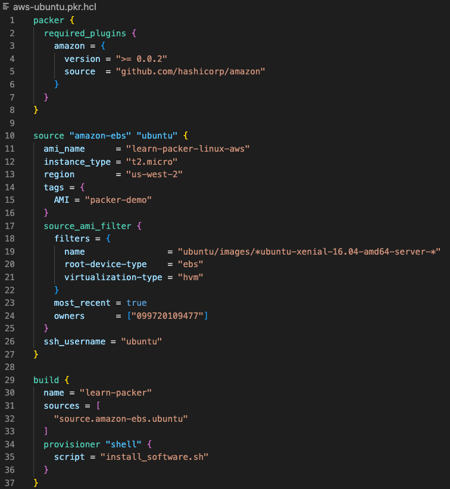

layout: false
class: col-2
background-image: url(../../assets/images/backgrounds/HashiCorp-Content-bkg.png)
background-size: cover
name: Setup Packer for Terraform
count: true

# Setup Packer for Terraform

#### 1. Install Packer & Terraform
#### 2. Create a Packer template file and configure the following:
     1. Source
     2. Build
     3. Provisioner
#### 4. Run the `build` command  

 

???

To get started, you'll need to install both Packer and Terraform on your machine or server.
Next, you'll create a configuration file in Packer that specifies image/reseource you'd like to create. Along with the script or commands needed to install the desired software within the image. 

Replace the "Source" attributes below for your use case. 

Make sure you workstation is authenticated and has access to resources needed to create the image. In this case AWS Console. 
