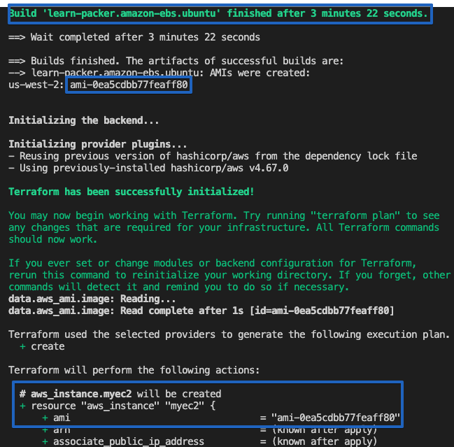

layout: false
class:  col-2
background-image: url(../../assets/images/backgrounds/HashiCorp-Content-bkg.png)
background-size: cover
name: Generate AWS Creds
count: true

# Infrastructure Automation

```hcl
#!/bin/bash
packer build aws-ubuntu.pkr.hcl
terraform init 
terraform apply
```
Create a script to build & deploy your infrastructure, while leveraging Packer & Terraform

 


???

Now that your AWS access keys are in Vault, you can use Terraform to generate dynamic AWS credentials that can be used by applications and services. Here's an example of how to create an install script and successfully building and AWS EBS Ec2.